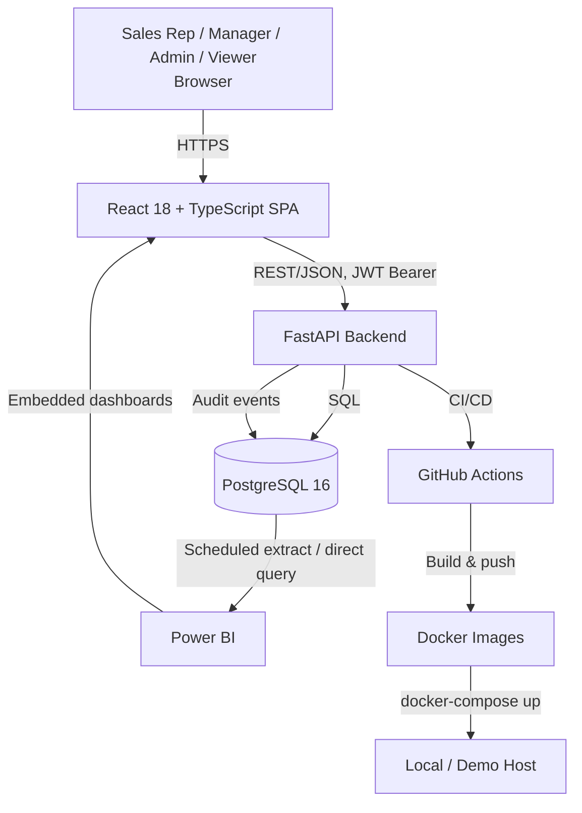
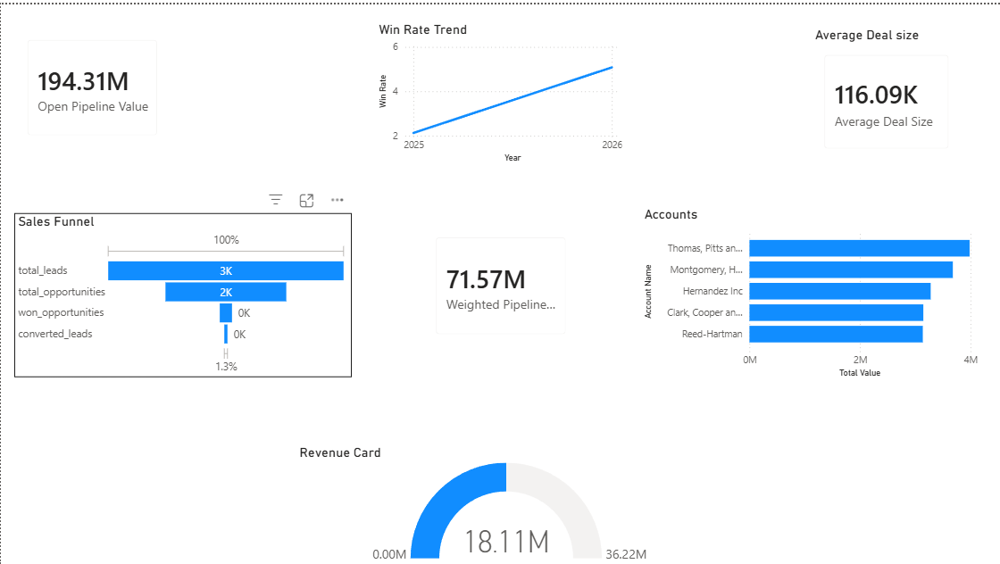
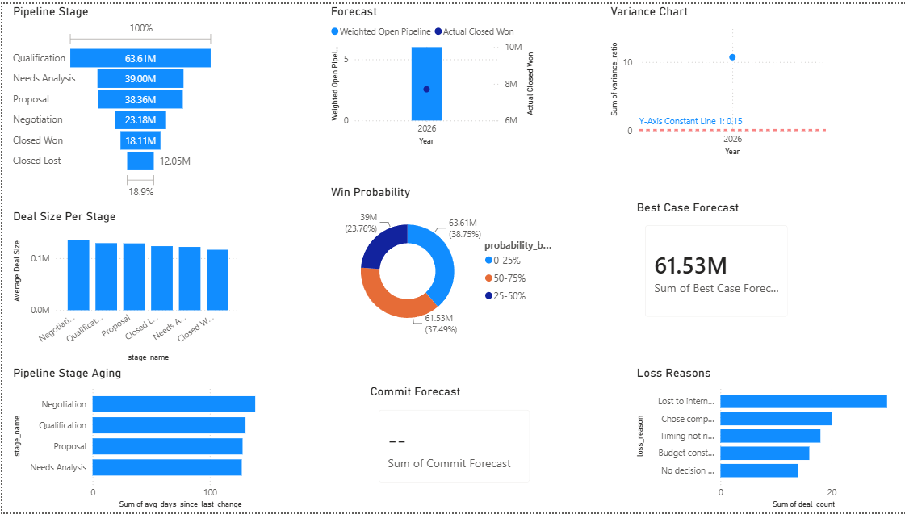
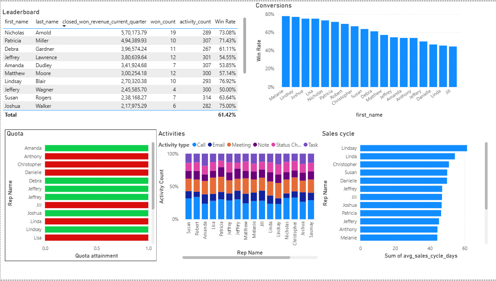
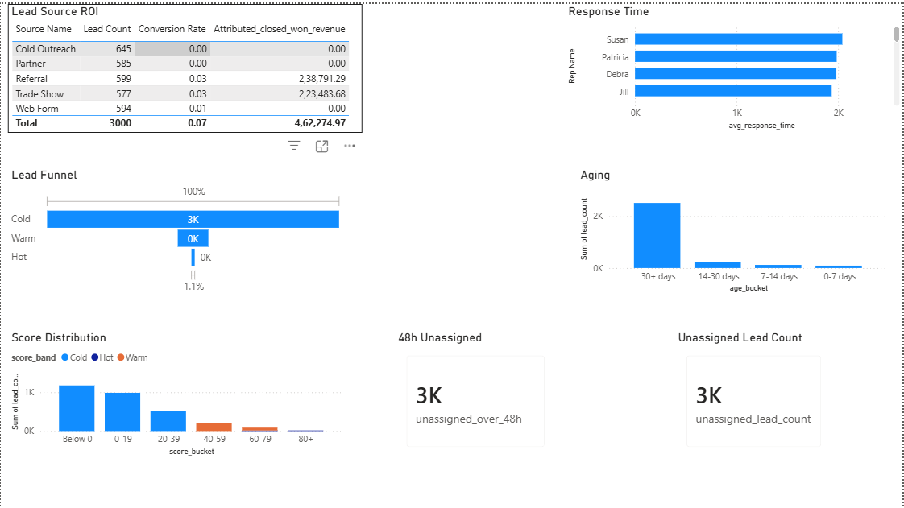

# CRM & Sales Analytics Platform

> A full-stack CRM — lead scoring, pipeline management, and 4 Power BI dashboards — built solo from
> BRD to deployment, with every requirement traced end-to-end (`BR → FR → US → UAT`) and 5 real
> bugs found and fixed by actually executing all 44 UAT cases against the live app, not just
> reading the code.

**Live demo:** pending deployment — see `DEPLOYMENT.md` (configs are ready; account creation is a manual step) · **Local demo:** `docker-compose up` — one command, see [Getting Started](#getting-started)

**Demo accounts** (after `docker-compose up`, seeded automatically):

| Role | Email | Password |
|---|---|---|
| Admin | `admin@northwindsales.com` | `Caesar@0&` |
| Manager | `manager.west@northwindsales.com` | `DemoPass123!` |
| Rep | `rep1@northwindsales.com` | `DemoPass123!` |
| Viewer | `viewer@northwindsales.com` | `DemoPass123!` |


---

## Table of Contents
- [Overview](#overview)
- [Architecture](#architecture)
- [Tech Stack](#tech-stack)
- [Features](#features)
- [Screenshots](#screenshots)
- [BA Artifacts Index](#ba-artifacts-index)
- [Metrics & Proof](#metrics--proof)
- [Getting Started](#getting-started)
- [Documentation](#documentation)
- [Roadmap](#roadmap)
- [Project Discipline](#project-discipline)
- [License](#license--author)

---

## Overview

**The problem:** small-to-mid sales teams routinely run on spreadsheets or an under-configured
free CRM tier — leads go unscored, pipeline stages are tracked inconsistently across reps, and
"what's our win rate by source this quarter" takes a Friday afternoon of manual Excel work instead
of a dashboard click.

**The solution:** this platform implements the 7 core modules a real sales org needs — lead
management with automated scoring/assignment, a Kanban opportunity pipeline with guarded stage
transitions, Account/Contact 360 views, activity tracking, 4 Power BI dashboards backed by a
documented SQL layer, configurable workflow automation, and RBAC + an immutable audit log — end to
end, from business requirements through a working, tested, containerized, CI-green application.

**Who this is for:** a sales team of ~10-50 reps needing lead scoring, pipeline visibility, and
manager-level analytics without the cost or complexity of Salesforce; also built explicitly as a
portfolio piece demonstrating BA-to-delivery fluency (see [Project Discipline](#project-discipline)).

## Architecture



Full justification for each layer, and the 4 architecture decision records (single-tenant design,
sync SQLAlchemy over async, JWT+revocation over sessions, modular monolith over microservices):
[`docs/Architecture.md`](docs/Architecture.md) and [`docs/ADR/`](docs/ADR/).

## Tech Stack

| Layer | Technology | Why |
|---|---|---|
| Backend | Python 3.11 + FastAPI | Auto-generated OpenAPI docs, async-capable, Pydantic typing matches a BA's plain-English-to-schema workflow |
| Frontend | React 18 + TypeScript + Tailwind + shadcn/ui | Type safety for a data-heavy UI; shadcn's copy-in-code model keeps every component inspectable |
| Database | PostgreSQL 16 | Relational integrity for strict CRM FK relationships; native CTEs/window functions for the KPI SQL layer |
| Auth | JWT + RBAC (4 roles) | Stateless, container-friendly; matches the fixed Admin/Manager/Rep/Viewer model in scope |
| Analytics | Power BI + a documented SQL layer | Industry-standard BI tool; every visual traces to a query in `analytics/sql_queries/` |
| Testing | pytest (60 tests, 79% coverage) + Vitest (10 tests) | Standard, well-documented tooling for the stack split |
| Deployment | Docker + docker-compose + GitHub Actions | One-command reproducibility; CI green-on-`main` is a checkable delivery signal |

**Explicitly excluded** (per the project's own constitution): Kafka, ClickHouse, microservices,
Kubernetes, Redis — see `docs/ADR/` for the reasoning; introducing any of these requires a new ADR.

## Features

- **Lead Management** — automated scoring (attribute/behavior/recency/negative-signal rules),
  Hot-lead auto-assignment to the least-loaded rep in the same transaction, manual reassignment
  restricted to Admin/Manager, lead conversion to Account/Contact/Opportunity
- **Opportunity Pipeline** — Kanban board with native drag-and-drop, an Admin-configurable
  allowed-transition graph (non-standard jumps require a Manager/Admin override + reason, logged),
  per-deal win-probability override, weighted pipeline value
- **Account & Contact 360** — unified view of contacts, opportunities, and activity timeline per
  account; single-primary-contact enforcement; duplicate-domain detection with override
- **Activity Tracking** — calls/emails/meetings/tasks/notes tied to any of lead/account/contact/
  opportunity, with overdue-task indicators
- **Sales Analytics Dashboards** — 4 Power BI dashboards (Executive Summary, Pipeline Health, Rep
  Performance, Lead Funnel), every visual traced to a documented KPI and a tested SQL query
- **Workflow Automation** — configurable event → condition → action rules (e.g. Hot lead →
  notification), toggleable without a deploy, with a separate execution log for auditability
- **RBAC + Audit Log** — 4 roles enforced at the API layer (never just hidden in the UI); an
  immutable audit log enforced by a Postgres trigger, independent of any application-layer check

## Screenshots

**Analytics dashboards** (Power BI, built on the SQL layer in `analytics/sql_queries/`):

| Executive Summary | Pipeline Health |
|---|---|
|  |  |

| Rep Performance | Lead Funnel |
|---|---|
|  |  |

Every visual traces to a documented KPI — see [`analytics/KPI_CROSS_CHECK.md`](analytics/KPI_CROSS_CHECK.md).

The Kanban pipeline, Leads list, Account 360, and RBAC gating (Admin/Manager/Rep/Viewer) were all
visually verified live in-browser against the running containerized stack during both Phase 4 and
the Phase 6 UAT execution pass (see [`docs/UAT_Results.md`](docs/UAT_Results.md)). Static image
captures of these app screens (beyond the analytics dashboards above) are a nice-to-have not yet
done — see [Roadmap](#roadmap).

## BA Artifacts Index

This is the section that differentiates a BA-track candidate from a pure dev portfolio: every one
of these was written *before* the corresponding code, not reverse-engineered afterward, and every
requirement traces forward to a test case.

| Artifact | Why it matters |
|---|---|
| [BRD.md](docs/BRD.md) | Business objectives, scope, and 24 numbered business rules — the source of truth every other document traces back to |
| [FRD.md](docs/FRD.md) | 66 functional requirements, each with an acceptance criterion and a `BR-xx` trace |
| [User_Stories.md](docs/User_Stories.md) | Epic → Feature → Story breakdown a Product Owner would recognize |
| [Gap_Analysis.md](docs/Gap_Analysis.md) | An honest comparison against Salesforce Essentials / HubSpot Free — including where this platform is deliberately *not* trying to compete |
| [ERD.md](docs/ERD.md) / [Data_Dictionary.md](docs/Data_Dictionary.md) | Full schema design (22 tables), documented addendum-by-addendum as real decisions were made, not written once and frozen |
| [Process_Flows/](docs/Process_Flows/) | Lead and opportunity lifecycle diagrams |
| [KPI_Catalog.md](docs/KPI_Catalog.md) | 23 KPIs, each with an owner role, refresh cadence, and target threshold |
| [UAT_Test_Scripts.md](docs/UAT_Test_Scripts.md) + [UAT_Results.md](docs/UAT_Results.md) | 44 documented test cases, all 44 actually executed against the live app with real observed results — not a checklist filled in from memory |
| [RACI_Matrix.md](docs/RACI_Matrix.md) | Who's Responsible/Accountable/Consulted/Informed for both the in-app roles and the delivery process itself |
| [Architecture.md](docs/Architecture.md) / [ADR/](docs/ADR/) | 4 architecture decision records, each with alternatives considered and rejected, not just the choice made |
| [PHASE_REPORTS/](docs/PHASE_REPORTS/) | A completion report per phase — what shipped, what broke, what was fixed, written contemporaneously |

The analytics layer's own documentation (SQL queries, KPI cross-check, Power BI build
instructions) lives in [`analytics/`](analytics/) — see [`analytics/README.md`](analytics/README.md).

## Metrics & Proof

No inflated round numbers — these are the actual counts as of the last commit, re-verified, not
estimated:

| Metric | Actual count |
|---|---|
| REST API endpoints | 71 |
| Database tables + views | 22 tables, 15 views |
| Seed records | ~11,200 across leads/accounts/contacts/opportunities/activities |
| Power BI dashboards | 4, each visual traced to a KPI |
| Documented KPIs | 23 (+ 1 governance KPI validated by the test suite, not a dashboard tile) |
| Backend test coverage | 79% (60 tests) |
| Frontend tests | 10 (Vitest) |
| UAT cases | 44 documented, 44 executed, 44/44 pass (5 real bugs found and fixed along the way — see `docs/UAT_Results.md`) |
| Lines of code | ~4,200 backend app + ~1,300 backend tests + ~4,900 frontend |

## Getting Started

**One command** (recommended — boots Postgres, backend, and frontend together; migrations and
demo data seed automatically):

```bash
git clone https://github.com/SaumayAshish/CRM-Sales-Analytics.git
cd CRM-Sales-Analytics
docker-compose up
```

Then open `http://localhost:8080` and log in with any account from the table at the top of this
README. Backend API docs: `http://localhost:8000/docs`.

**Manual (backend hot-reload for development):**

```bash
# Backend
cd backend
python -m venv .venv && .venv/Scripts/activate  # or source .venv/bin/activate on macOS/Linux
pip install -r requirements-dev.txt
cp .env.example .env
docker compose up -d db   # from the repo root, starts Postgres on port 5433
alembic upgrade head
python -m app.scripts.seed
uvicorn app.main:app --reload --port 8000
```

```bash
# Frontend
cd frontend
npm install
cp .env.example .env
npm run dev   # http://localhost:5173
```

## Documentation

This project follows a docs-first delivery model — see the [BA Artifacts Index](#ba-artifacts-index) above.

## Roadmap

What's next if this were a real, ongoing product rather than a fixed 6-phase delivery:

- Live deployment (Render + Vercel configs are ready in `render.yaml`/`frontend/vercel.json`;
  `DEPLOYMENT.md` has the exact steps — the account-creation click-through is the one remaining step)
- Static screenshot/GIF captures of the app screens (Kanban, Leads, Account 360, RBAC) for this README
- Pipeline Coverage Ratio and Average Time-to-Assignment KPIs need either a BA scope decision or
  live-app usage data (both documented precisely in `analytics/KPI_CROSS_CHECK.md`, not silently dropped)
- Power BI Row-Level Security is currently Desktop-simulated only ("View As Roles"); true
  multi-user enforcement needs a Power BI Service tenant with matching org accounts
- Email/SMS delivery for workflow notifications (currently stubbed/logged by design, per BRD §5.2)
- A true Kanban-scale fix (virtualized/paginated columns) if opportunity volume grows another
  order of magnitude past the current ~1,500

## Project Discipline

This project is delivered as a simulated real-world engagement: a Business Analyst (project owner)
working with a Senior Full-Stack Engineer role, following a fixed 6-phase delivery plan with
phase-gate approvals, full requirement traceability (`BR → FR → US → UAT`), and conventional
commit discipline. See `CLAUDE.md` for the full project constitution (kept local/untracked by
design — it's a working instruction set, not a deliverable).

## License & Author

MIT License (see `LICENSE`). Built by **Saumay Ashish**, positioning as an
**Engineering-Literate Business Analyst**: reads code, writes SQL, builds Power BI dashboards,
specifies technical requirements precisely enough that they're directly implementable.

<!-- Add your LinkedIn/portfolio link here before publishing. -->
