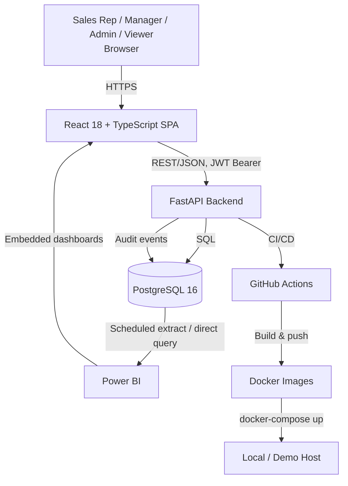
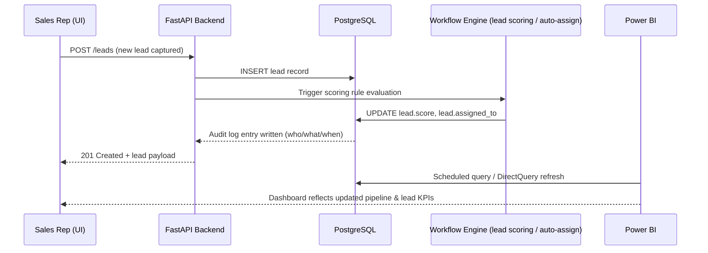

# Architecture Document

**Project:** CRM & Sales Analytics Platform
**Document owner:** Saumay Ashish (Business Analyst)
**Status:** Approved for Phase 1 baseline
**Traceability:** This document anchors ADR-001 through ADR-004 and constrains all requirements in `BRD.md` / `FRD.md`.

---

## 1. Purpose

This document defines the system's high-level technical shape so that business and functional requirements are written against a real, fixed architecture rather than an assumed one. Any requirement that implies an architectural change outside what is described here must be raised as a new ADR before it is accepted into scope.

---

## 2. System Context

The platform is a **single-tenant, single-organization CRM and analytics system** used internally by one company's sales department. It is not sold as multi-customer SaaS in this version (see ADR-004).



---

## 3. Tech Stack & Justification

| Layer | Technology | Justification |
|---|---|---|
| Frontend | React 18 + TypeScript | Type safety for a data-heavy UI (pipeline, tables, forms); TypeScript is the de facto expectation for frontend hiring in 2026. |
| UI Components | Tailwind + shadcn/ui | Fast, consistent, accessible components without a heavy design system; shadcn's copy-in-code model keeps the codebase inspectable (portfolio value — reviewers can read the actual component code). |
| Backend | Python 3.11 + FastAPI | Async-capable, automatic OpenAPI docs (directly supports the "40+ documented REST endpoints" target), strong typing via Pydantic matches the BA's plain-English-to-schema translation workflow. |
| Database | PostgreSQL 16 | Relational integrity for CRM entities (leads, accounts, opportunities have strict FK relationships); native support for window functions and CTEs needed for KPI SQL; free and portable. |
| Auth | JWT + RBAC | Stateless auth suits a containerized deployment without a session store; RBAC (not ABAC) matches the fixed 4-role model in scope. |
| Analytics | Power BI + embedded dashboards | Industry-standard BI tool for the target employers (Salesforce/Accenture/Deloitte ecosystems commonly pair CRM data with Power BI or Tableau); demonstrates SQL-to-dashboard fluency, a core BA skill. |
| Testing | pytest + Vitest | Standard, well-documented tooling matching the backend/frontend split; supports the 70%+ backend coverage target. |
| Deployment | Docker + docker-compose + GitHub Actions | One-command reproducibility (`docker-compose up`) for reviewers; CI green-on-main is a concrete, checkable signal of delivery discipline. |

**Explicitly excluded (per the project's technology constitution):** Kafka, ClickHouse, microservices, Kubernetes, Redis. See ADR-001 and ADR-004 for the reasoning; any future request to introduce these requires a new ADR with written justification.

---

## 4. Data Flow: Lead → Database → Dashboard



---

## 5. Security Architecture

### 5.1 Authentication
- JWT access tokens (short-lived) issued on login; refresh token rotation for session continuity.
- Passwords hashed with bcrypt; no plaintext storage.

### 5.2 Authorization (RBAC)
Four fixed roles, enforced at the API layer (not just hidden in the UI):

| Role | Access Level |
|---|---|
| **Admin** | Full CRUD on all entities, user/role management, system configuration, full audit log access. |
| **Manager** | Full CRUD on team's leads/opportunities/accounts, pipeline and forecast dashboards, cannot manage users or system config. |
| **Rep** | CRUD on own assigned leads/opportunities/contacts only; read-only on team dashboards. |
| **Viewer** | Read-only access to dashboards and reports; no create/update/delete anywhere. |

Enforcement pattern: every protected endpoint checks role + record ownership (e.g., a Rep can only mutate records where `assigned_to = current_user.id`) via a FastAPI dependency, not client-side logic alone.

### 5.3 Audit Logging
Every create/update/delete on business entities (leads, opportunities, accounts, contacts, users) writes an immutable audit record: actor, action, entity, before/after state (where feasible), timestamp. This satisfies Module 7 (RBAC + Audit Log) and is referenced by KPI/UAT traceability.

### 5.4 Data Protection
- All traffic over HTTPS (TLS terminated at reverse proxy in deployment).
- Environment secrets (DB credentials, JWT signing key) via `.env`, never committed (already reflected in repo hygiene).

---

## 6. Deployment Topology

```mermaid
graph LR
    subgraph Docker Compose Stack
        FE[Frontend Container<br/>React build served via Nginx]
        BE[Backend Container<br/>FastAPI/Uvicorn]
        DBC[(Postgres Container)]
    end
    FE --> BE
    BE --> DBC
    CI[GitHub Actions] -->|build, test, push images| Docker Compose Stack
```

- Single `docker-compose.yml` orchestrates all three services for local/demo use (Phase 6).
- GitHub Actions runs lint + pytest + Vitest on every push/PR; must be green on `main` per Definition of Done.
- No orchestration platform (Kubernetes) — justified in ADR-001 given single-tenant, single-deployment scope.

---

## 7. Constraints Carried Forward Into Requirements

1. All functional requirements (FRD) must be satisfiable within a single Postgres database — no requirement may assume a secondary datastore.
2. All role-based requirements must map to exactly one of the four fixed roles — no new roles without an ADR.
3. All requirements must be deliverable via REST endpoints exposed by a single FastAPI service — no requirement may assume a separate service boundary.
4. Reporting requirements must be satisfiable via SQL queries against the Postgres schema, consumable by Power BI — no requirement may assume a separate analytics datastore (rules out ClickHouse-style pre-aggregation).

---

## 8. Related Documents
- `ADR/001-monolith-vs-microservices.md`
- `ADR/002-postgres-vs-mongo.md`
- `ADR/003-jwt-vs-session-auth.md`
- `ADR/004-single-tenant-vs-multi-tenant.md`
- `BRD.md` (business objectives this architecture serves)
- `ERD.md` (schema realization of the constraints above)
