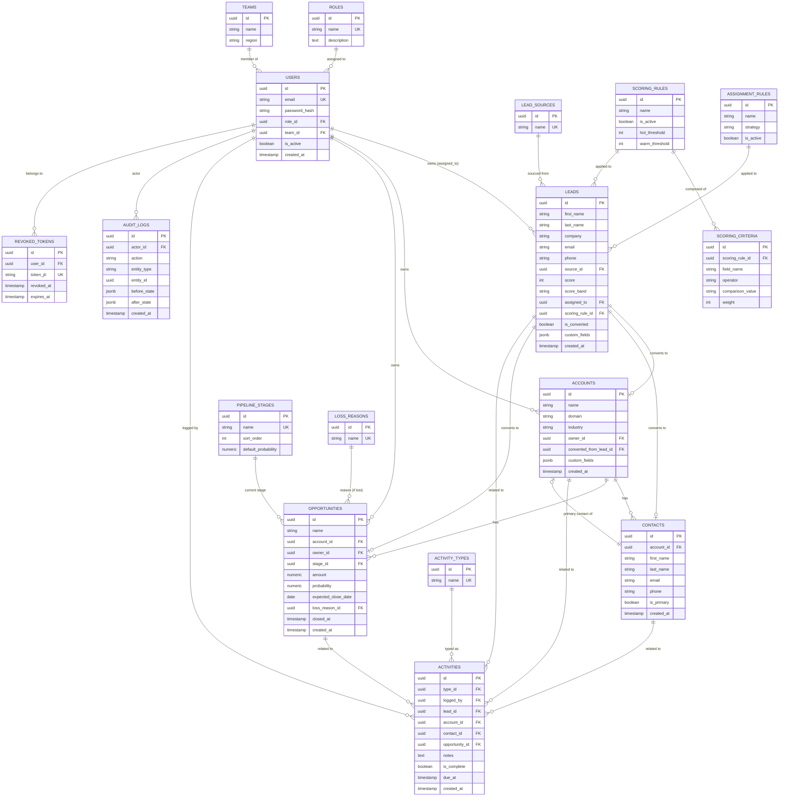

# Entity Relationship Diagram (ERD)

**Traceability:** Realizes the data requirements in `FRD.md` §4, constrained to a single PostgreSQL database (ADR-002) and single-tenant scope (ADR-004). Column-level detail (types, constraints, sample values, per-column BRD/FRD trace) is in `Data_Dictionary.md`.

**Table count:** 17 tables (exceeds the 15+ target metric).

---

## 1. Full ERD

---

## 2. Relationship Notes

- **Lead → Account/Contact/Opportunity** is a one-time, one-way conversion (BR-04): `leads.is_converted` flips to `true` and the three created records store a back-reference (`accounts.converted_from_lead_id`), rather than a bidirectional many-to-many — this enforces "converted once" at the schema level, not just application logic.
- **Contacts.is_primary** is enforced as "exactly one true per account" via application-layer transaction logic (FR-18), not a database constraint, since Postgres does not natively support a "unique where true" constraint without a partial unique index — which **is** used here: `CREATE UNIQUE INDEX ON contacts (account_id) WHERE is_primary`. This is documented in `Data_Dictionary.md`.
- **Audit_logs** has no foreign key `ON DELETE CASCADE` from any entity — it intentionally does not reference entities with enforced referential integrity that would allow a cascade delete to erase history (BR-15). `entity_id` is a loose UUID reference, not an FK, specifically so deleting a business record can never delete its audit trail.
- **Scoring_rules → Scoring_criteria** is one-to-many so a rule can be composed of multiple weighted criteria (e.g., "company size > 500 → +20", "source = referral → +15"), satisfying FR-33's requirement for a documented, testable rule set rather than inline conditionals.
- **Revoked_tokens** exists solely to support ADR-003's refresh-time revocation check — it is not a general session store.

---

## 3. Explicitly Not Modeled (Out of Scope)

Per `BRD.md` §5.2: no `tenant_id`/`organization_id` column exists on any table (single-tenant, ADR-004); no billing/invoice tables; no marketing campaign tables; no multi-currency columns (amount is a single `numeric` in one implied currency).
