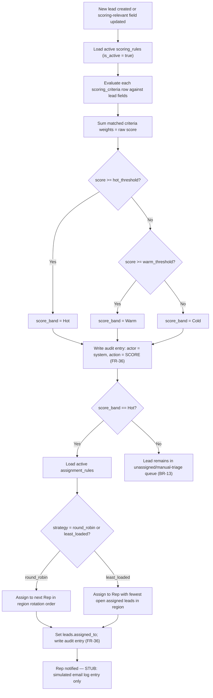

# Process Flow: Lead Scoring & Auto-Assignment Decision Tree

**Traces to:** BR-02, BR-03, BR-18, FR-02 through FR-04, FR-33 through FR-37

## Scoring Decision Tree

## Example Scoring Criteria (illustrative configuration, not hardcoded logic)

| field_name | operator | comparison_value | weight |
|---|---|---|---|
| source_id | equals | "Referral" | +15 |
| company_employee_count (custom_field) | greater_than | 500 | +20 |
| source_id | equals | "Trade Show" | +10 |
| email_domain | is_free_provider (e.g., gmail.com) | true | -10 |

Example thresholds: `hot_threshold = 70`, `warm_threshold = 40`. A lead matching Referral (+15) and employee count > 500 (+20) scores 35 → Warm, not Hot — illustrating that thresholds and weights are tunable business decisions (BR-18), not fixed in this document.

## Exception Paths

| Exception | Handling |
|---|---|
| No active scoring_rules configured | Lead defaults to score = 0, band = Cold, remains in manual triage queue — system never fails silently or leaves score null. |
| Hot lead scored but no active assignment_rules configured | Lead stays Hot but unassigned, surfaced in the Manager/Admin unassigned queue (BR-13) rather than blocking the scoring transaction. |
| Assignment strategy references a region with zero active Reps | Falls back to manual assignment queue; system logs a warning-level audit entry rather than throwing an unhandled error. |
| Lead field update changes score after conversion | Scoring re-evaluation is skipped once `is_converted = true` — a converted lead's score is historical, not live (prevents a closed deal's originating lead from silently re-triggering assignment workflows). |
