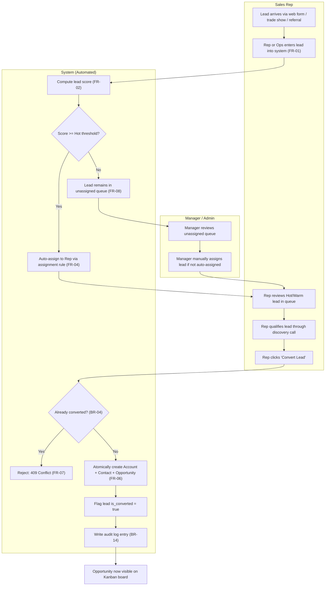

# Process Flow: Lead-to-Opportunity Lifecycle

**Traces to:** BR-01 through BR-04, FR-01 through FR-08, FR-06, FR-07

## Swimlane Diagram

## Exception Paths

| Exception | Handling |
|---|---|
| Lead missing required fields (name/company/email/source) | Rejected at entry, form/API validation error (FR-01). Never reaches scoring. |
| Duplicate conversion attempt | System returns 409, no partial Account/Contact/Opportunity created (FR-07). |
| Lead scored Hot but no Rep available in assignment pool | Falls back to unassigned queue for manual Manager triage (BR-13), same as a Warm/Cold lead. |
| Lead qualifies but Rep decides not to pursue | Lead can be manually marked "Disqualified" (status field) without conversion — remains in system for reporting, not deleted (supports Lead Performance KPIs). |
