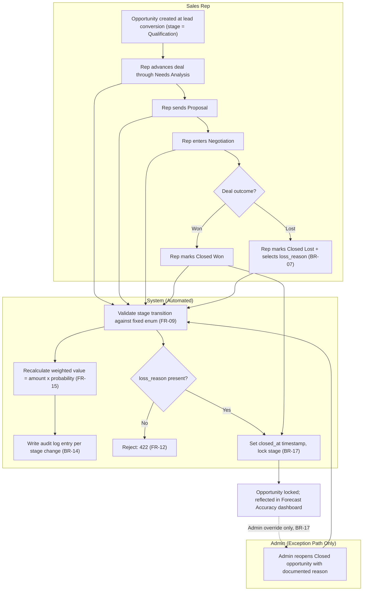

# Process Flow: Opportunity-to-Close (Deal Progression)

**Traces to:** BR-05 through BR-07, BR-16, BR-17, FR-09 through FR-16

## Swimlane Diagram

## Decision Gates

| Gate | Condition | Path |
|---|---|---|
| Stage transition validity | Is the target stage a valid enum value in the fixed sequence? | Valid → proceed; Invalid → 422 rejection (FR-09) |
| Closed Lost completeness | Is `loss_reason_id` populated? | Yes → finalize as Closed Lost; No → reject save (FR-12) |
| Post-close mutation | Is the actor an Admin providing a reason? | Yes → reopen permitted, logged; No (Manager/Rep) → 403 (BR-17, FR-14) |

## Exception Paths

| Exception | Handling |
|---|---|
| Rep attempts to skip a stage (e.g., Qualification → Negotiation directly) | Allowed by default (stage order is informational for the Kanban view, not a hard sequential gate) unless Sales Ops configures strict sequential enforcement — documented here as a configuration choice, not a hardcoded restriction, since real sales cycles don't always move linearly. |
| Two users change the same opportunity's stage simultaneously | Last write wins at the DB transaction level; both attempts are individually audit-logged so the sequence is reconstructable (see `FRD.md` §8). |
| Closed opportunity needs correction after go-live | Only Admin can reopen, must supply a reason, and the action is fully audited (BR-17, FR-14). |
